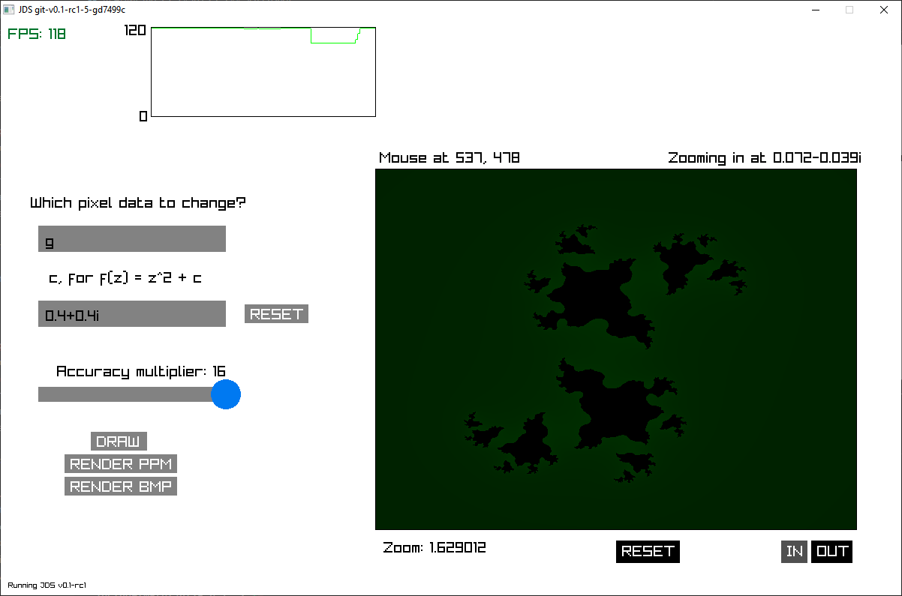

# jds
Julia Set viewer written in C. Cross-platform for both Linux and Windows. No external dependencies other than raylib as a GUI.

## Getting JDS
You can get the most stable release from the [releases](https://github.com/mxtlrr/jds/releases) tab. If you would like to compile from scratch, install:
- 64-bit GCC
- Raylib (if Windows, [click here](https://github.com/raysan5/raylib/wiki/Working-on-Windows))

Then, just run `make`. If you encounter any issues, open an [issue](https://github.com/mxtlrr/jds/issues)

## Using JDS
TODO

# Screenshot

*JDS rendering* $f_c(z) = z^2 + 0.4+0.4i$*, slightly zoomed into* $0.072-0.039i$*. Taken 7 February 2025.*

# Desired Features
- [ ] Optimize zooming (drops to $< 30$ FPS when zooming)
- [ ] Arbitrary floating point precision to be able to zoom in arbitrarily much.
- [ ] Add more GUI elements
  - [X] Checkboxes
  - [X] Dropdowns (for rendering)
  - [ ] Improve on sliders and textboxes (add backspacing and cursor)
- [ ] Give user more control over the fractal polynomial
- [ ] Custom palette generation other than it being based off of red, green or blue.
- [ ] Swap between continous and discrete coloring.
- [ ] Render to more than just PPM and BMP (i.e. JPEG).

# Contribution
Open a pull request.