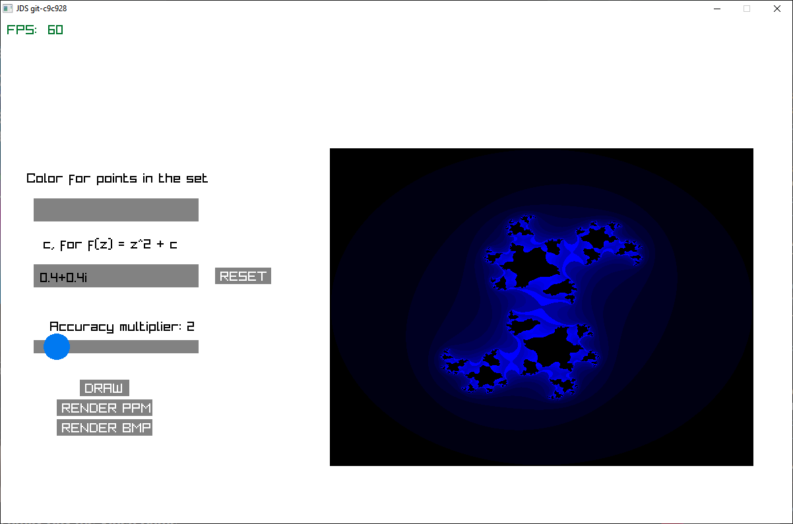

# jds
Julia Set viewer written in C. Cross-platform for both Linux and Windows. No external dependencies other than:
- Graphics library (raylib)
- Arbitrary Floating-Point Precision Library (libGMP)

## Getting JDS
TODO

## Using JDS
TODO

## Screenshot

*JDS rendering* $f_c(z) = z^2 + 0.4+0.4i$ *with an escape value of* $10$

# What's a Julia Set?
The Julia set, $J$, is defined from a function $f_c$. Values in this set are known
to be "chaotic", meaning that a small change in any element could completely
change behaviour, i.e. escape off to infinity.

To check if $p \in J$ for any point $p$, we'd repeatedly apply $f_c$ to it $n$
times. If, at any point, $p > R$, then it is not part of the set. To give
interesting results, $R$, the escape radius can be modified. An example is the
Mandlebrot set has an $R = \pm 2$

Typically, $f_c$ looks like a quadratic, namely $f_c(z) = z^2 + c$, where $c \in
\mathbb{C}$ (additionally, $c$ is the only thing you're able to change). An 
example of $f_c$ could be $f_c(z) = z^2 + 0.45 + 0.1428i$, $i=\sqrt{-1}$.

## What about all those cool colors I see?
There are two main ways to add color to a Julia set render:
- Escape time (more rough/discrete)
- Smooth coloring (continous)

### Escape time algorithm
It's a very simple algorithm:
1. For every pixel, store the amount of iterations it takes to escape to infinity
    1. If it doesn't color it black. 
2. Look the value up in some look up table
3. Color the pixel accordingly

### Smooth coloring
TODO

# Planned Features
- [ ] Exporting to image formats
  - [X] PPM
  - [ ] BMP
  - [ ] JPEG
- [ ] Coloring
  - [ ] Smooth coloring (checkbox?)
  - [X] "discrete" coloring (non-smooth / non-continous)
- [X] Customizing parameters:
  - [X] Accuracy radius
  - [X] $c$
- [ ] Zooming in/out